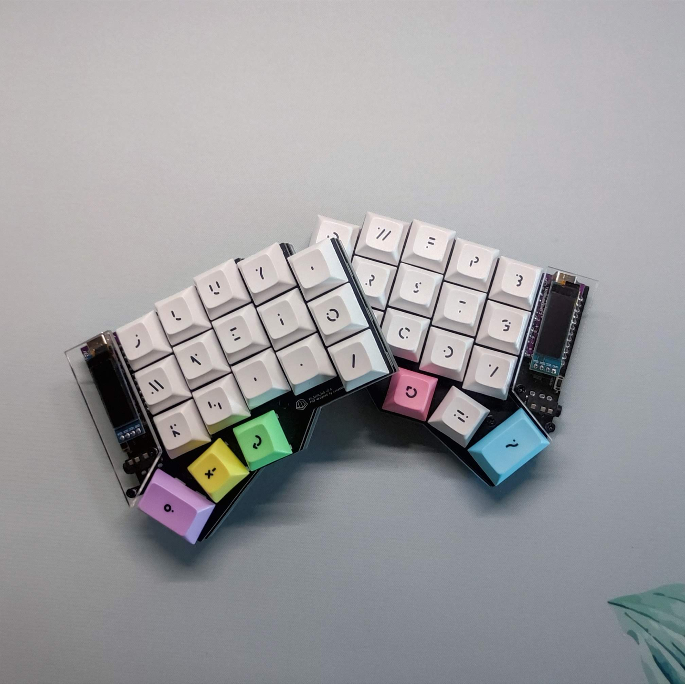
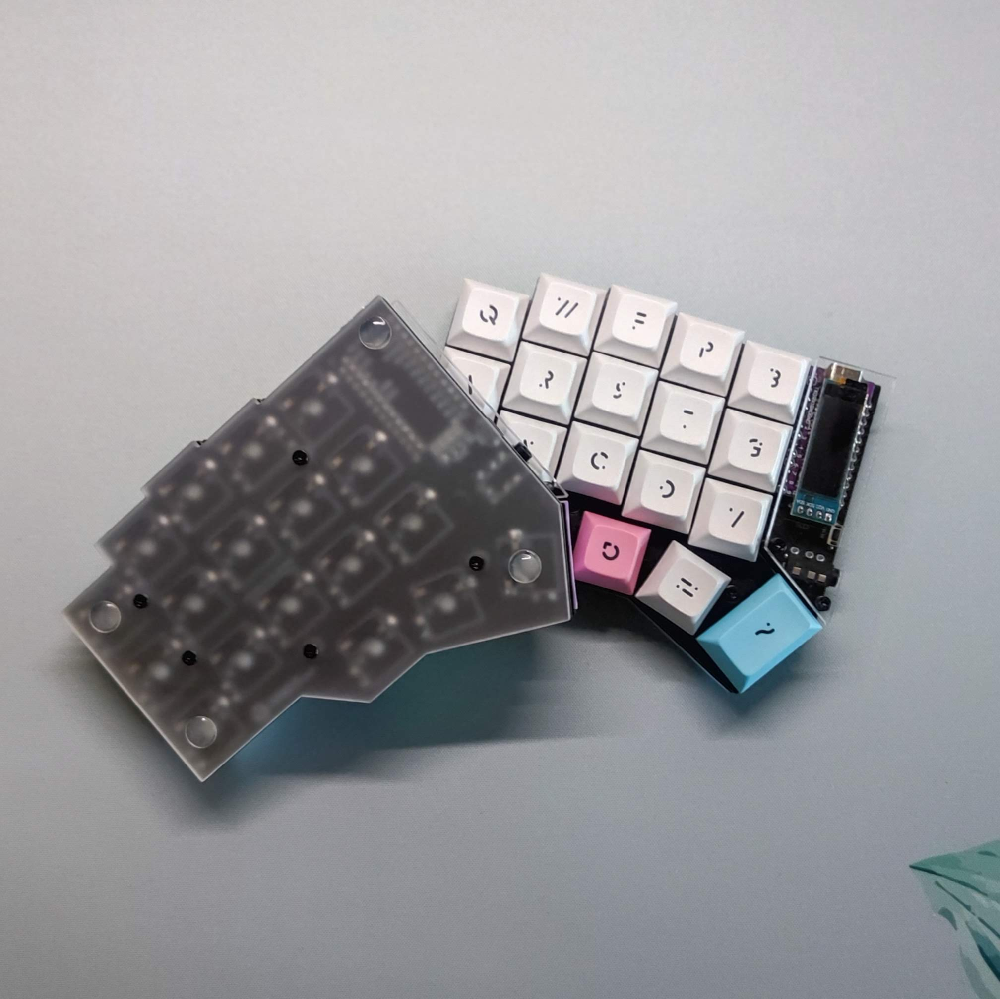

# EK_Split_3x5
⌨️ *The EK_Split_3x5 is a split keyboard with 3x5 column staggered keys and 3 thumb keys, based on [crkbd](https://github.com/foostan/crkbd).*

| Front side | Back side |
| ----- | ----- |
|  |  |

<!-- ## ✨ Pros:

- 📦 ~6kb (gzipped, full package)
- 🙅‍♂️ Zero dependencies
- 📱 Supports touch devices
- ⚒ CommonJS and ES Modules support
- ✅ Optimized for Accessibilty
- 🌈 Easy to customize
- 🦄 Optimized for performance
- 💅 More-reliant on CSS over JavaScript -->

## 📖 Documentation

*🚧 WIP*

<!-- ## 👀 Showcase -->

## 👤 Author

**LucasAlt**
* Website: https://www.lucasalt.fr
* Twitter: [@LucasCtrlAlt](https://twitter.com/LucasCtrlAlt)
* GitHub: [@LucasCtrl](https://github.com/LucasCtrl)

<!-- ## 🙏 Thanks
* [**@username**](https://github.com/username) - What I do
* [And many more!](https://github.com/ElsassKabel/EK_Split_3x5/graphs/contributors) -->

## 🤝 Contributing

<!-- Before contributing to this project, make sure you have read the [contribution guidelines](https://github.com/ElsassKabel/EK_Split_3x5/blob/main/CONTRIBUTING.md)! -->

1. Fork it (https://github.com/ElsassKabel/EK_Split_3x5/fork)
2. Create your feature branch (`git checkout -b feature/fooBar`)
3. Commit your changes (`git commit -am 'Add some fooBar'`)
4. Push to the branch (`git push origin feature/fooBar`)
5. Create a new Pull Request

## Show your support

- Give a ⭐️ if you like this project!

<!--  -->

## 📝 License

This project is open source and available under the [MIT License](https://github.com/ElsassKabel/EK_Split_3x5/blob/main/LICENSE.md)